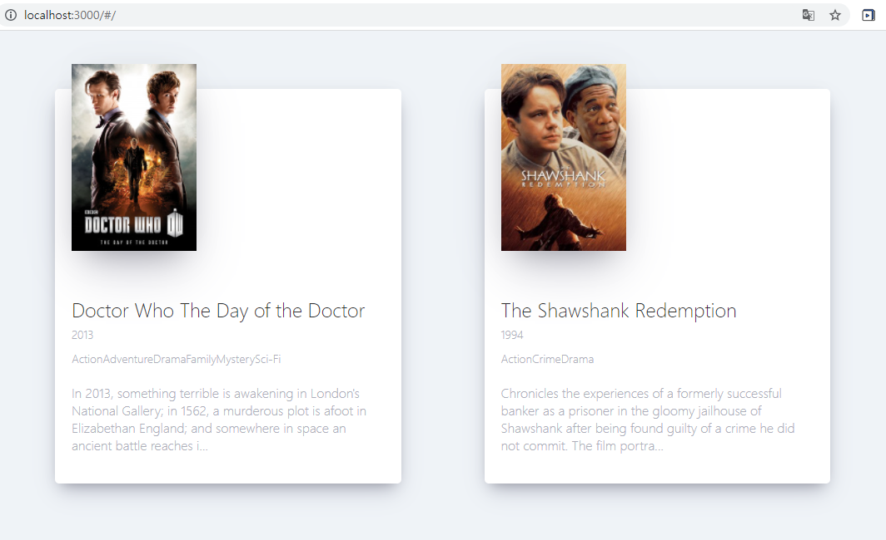

# 박민형 [201840212]

<hr>

## [12/08 15주차 수업 (보강)]

### 리스트와 Key
> 아래는 map()함수를 이용하여 numbers 배열의 값을 두배로 만든 후 map()에서 반환하는 새 배열을 doubled 변수에 할당하고 로그를 확인하는 코드입니다.
```js
const numbers = [1, 2, 3, 4, 5];
const doubled = numbers.map((number) => number * 2);
console.log(doubled);
```
#### 여러개의 컴포넌트 렌더링 하기
* 엘리먼트 모음을 만들고 중괄호 {}를 이용하여 JSX에 포함 시킬 수 있습니다.

>아래의 JavaScript map() 함수를 사용하여 numbers 배열을 반복 실행합니다. 각 항목에 대해 < li> 엘리먼트를 반환하고 엘리먼트 배열의 결과를 listItems에 저장합니다. listItems 배열을 < ul>엘리먼트 안에 포함하고 DOM에 렌더링합니다.

[codepen 에서 실행해보기](https://codepen.io/gaearon/pen/GjPyQr?editors=0011)

#### 기본 리스트 컴포넌트

* 이전 예시를 numbers 배열을 받아서 순서 없는 엘리먼트 리스트를 출력하는 컴포넌트로 리팩토링할 수 있습니다.

*  key를 넣어야 한다는 경고가 표시됩니다. “key”는 엘리먼트 리스트를 만들 때 포함해야 하는 특수한 문자열 어트리뷰트입니다.

[codepen 에서 실행해보기](https://codepen.io/gaearon/pen/jrXYRR?editors=0011)


#### Key

> * React가 어떤 항목을 변경, 추가 또는 삭제할지 식별하는 것에 도움을 줍니다
> * 엘리먼트에 안정적인 고유성을 부여하기 위해 배열 내부의 엘리먼트에 지정
> * 항목이 고정적인 순서를 가질때 사용을합니다 
> * 순서가 유동적인 경우에는 사용에 주의 가 필요합니다 성능저하및 state와 충돌이 발생할수있습니다.

#### key 로 컴포넌트 추출하기

키는 주변 배열의 context에서만 의미가 있습니다

>예를 들어 ListItem 컴포넌트를 추출 한 경우 ListItem 안에 있는 < li> 엘리먼트가 아니라 배열의 < ListItem /> 엘리먼트가 key를 가져야 합니다.

#### ※ 잘못된 사용법
```js
function ListItem(props) {
  const value = props.value;
  return (
    // 틀렸습니다! 여기에는 key를 지정할 필요가 없습니다.
    <li key={value.toString()}>
      {value}
    </li>
  );
}

function NumberList(props) {
  const numbers = props.numbers;
  const listItems = numbers.map((number) =>
    // 틀렸습니다! 여기에 key를 지정해야 합니다.
    <ListItem value={number} />
  );
  return (
    <ul>
      {listItems}
    </ul>
  );
}

const numbers = [1, 2, 3, 4, 5];
ReactDOM.render(
  <NumberList numbers={numbers} />,
  document.getElementById('root')
);
```
#### ※ 적절한 사용법
```js
function ListItem(props) {
  // 맞습니다! 여기에는 key를 지정할 필요가 없습니다.
  return <li>{props.value}</li>;
}

function NumberList(props) {
  const numbers = props.numbers;
  const listItems = numbers.map((number) =>
    // 맞습니다! 배열 안에 key를 지정해야 합니다.
    <ListItem key={number.toString()} value={number} />
  );
  return (
    <ul>
      {listItems}
    </ul>
  );
}

const numbers = [1, 2, 3, 4, 5];
ReactDOM.render(
  <NumberList numbers={numbers} />,
  document.getElementById('root')
);
```
#### key는 형제 사이에서만 고유한 값이어야 한다
>* key는 배열 안에서만 고유성을 가져도 가능합니다
>* 다수의 배열을 사용할때에 동일한 키값을 가져도 무방합니다

[codepen에서 확인해보기](https://codepen.io/gaearon/pen/NRZYGN?editors=0010)

* React에서 key는 힌트를 제공하지만 컴포넌트로 전달하지는 않습니다. 컴포넌트에서 key와 동일한 값이 필요하면 다른 이름의 prop으로 명시적으로 전달합니다.

```js
const content = posts.map((post) =>
  <Post
    key={post.id}
    id={post.id}
    title={post.title} />
);
```

#### jsx에 map() 포함시키기

* JSX를 사용하면 중괄호 안에 모든 표현식을 포함 시킬 수 있으므로 map() 함수의 결과를 인라인으로 처리할 수 있습니다.

* 이 방식을 사용하면 코드가 더 깔끔해 지지만, 이 방식을 남발하는 것은 좋지 않습니다. 

* JavaScript와 마찬가지로 가독성을 위해 변수로 추출해야 할지 아니면 인라인으로 넣을지는 개발자가 직접 판단해야 합니다. 

* map() 함수가 너무 중첩된다면 컴포넌트로 추출 하는 것이 좋습니다.


### 9. 폼

#### 제어 컴포넌트 (Controlled Component)

* HTML에서 < input>, < textarea>, < select>와 같은 폼 엘리먼트는 일반적으로 사용자의 입력을 기반으로 자신의 state를 관리하고 업데이트합니다

* React에서는 변경할 수 있는 state가 일반적으로 컴포넌트의 state 속성에 유지되며 setState()에 의해 업데이트

이름이 기록되는 폼을 제어 컴포넌트로 작성이 가능합니다

[codepen 에서 확인하기](https://codepen.io/gaearon/pen/VmmPgp?editors=0010)

* value 어트리뷰트는 폼 엘리먼트에 설정되므로 표시되는 값은 항상 this.state.value

* 모든 키 입력에서 handleChange가 동작하기 때문에 사용자가 입력할 때 보여지는 값이 업데이트됩니다.

#### textarea 태그
* HTML에서 < textarea> 엘리먼트는 텍스트를 자식으로 정의합니다

* this.state.value를 생성자에서 초기화하므로 textarea는 일부 텍스트를 가진채 시작되는 점을 주의
#### select 태그

#### 다중 입력 제어하기


### state 끌어올리기
>주어진 온도에서 물의 끓는 여부를 추정하는 온도 계산기를 만들어볼 것입니다.

* BoilingVerdict라는 이름의 컴포넌트부터 만들어봅시다. 이 컴포넌트는 섭씨온도를 의미하는 celsius prop를 받아서 이 온도가 물이 끓기에 충분한지 여부를 출력합니다.

* Calculator라는 컴포넌트를 만들어보겠습니다. 이 컴포넌트는 온도를 입력할 수 있는 < input>을 렌더링하고 그 값을 this.state.temperature에 저장

[codepen 에서 확인하기](https://codepen.io/gaearon/pen/ZXeOBm?editors=0010)

#### 두번째 input 추가하기
>섭씨 입력 필드뿐만 아니라 화씨 입력 필드를 추가하고 두 필드 간에 동기화 상태를 유지

* Calculator에서 TemperatureInput 컴포넌트를 빼내는 작업부터 시작해봅시다. 또한 "c" 또는 "f"의 값을 가질 수 있는 scale prop를 추가

* 이제 Calculator가 분리된 두 개의 온도 입력 필드를 렌더링하도록 변경할 수 있습니다.

[codepen 에서 확인하기](https://codepen.io/gaearon/pen/jGBryx?editors=0010)
>이제 두 개의 입력 필드를 갖게 되었습니다. 그러나 둘 중 하나에 온도를 입력하더라도 다른 하나는 갱신되지 않는 문제

#### 변환 함수 작성하기

> 섭씨 <-->  화씨 를 계산해주는 함수를 작성합니다. 

```js
// 화씨 > 섭씨
function toCelsius(fahrenheit) {
  return (fahrenheit - 32) * 5 / 9;
}
// 섭씨 > 화씨
function toFahrenheit(celsius) {
  return (celsius * 9 / 5) + 32;
}
```

* 이 함수는 올바르지 않은 temperature 값에 대해서는 빈 문자열을 반환하고 값을 소수점 세 번째 자리로 반올림하여 출력

```js
function tryConvert(temperature, convert) {
  const input = parseFloat(temperature);
  if (Number.isNaN(input)) {
    return '';
  }
  const output = convert(input);
  const rounded = Math.round(output * 1000) / 1000;
  return rounded.toString();
}
```
* tryConvert('abc', toCelsius)는 빈 문자열을 반환
* tryConvert('10.22', toFahrenheit)는 '50.396'을 반환

#### state 끌어올리기

> 위의 과정까지 진행시에 각각의 입력값을 자신의  state에 독립적으로 저장하고 있습니다.

###### 입력값을 변경할 때 일어나는 일들을 정리해보겠습니다.

> * React는 DOM < input>의 onChange에 지정된 함수를 호출합니다. 위 예시의 경우 TemperatureInput의 handleChange 메서드에 해당합니다.
>* TemperatureInput 컴포넌트의 handleChange 메서드는 새로 입력된 값과 함께 this.props.onTemperatureChange()를 호출합니다. onTemperatureChange를 포함한 이 컴포넌트의 props는 부모 컴포넌트인 Calculator로부터 제공받은 것입니다.
>* 이전 렌더링 단계에서, Calculator는 섭씨 TemperatureInput의 onTemperatureChange를 Calculator의 handleCelsiusChange 메서드로, 화씨 TemperatureInput의 onTemperatureChange를 Calculator의 handleFahrenheitChange 메서드로 지정해놓았습니다. 따라서 우리가 둘 중에 어떤 입력 필드를 수정하느냐에 따라서 Calculator의 두 메서드 중 하나가 호출됩니다.
>* 이들 메서드는 내부적으로 Calculator 컴포넌트가 새 입력값, 그리고 현재 수정한 입력 필드의 입력 단위와 함께 this.setState()를 호출하게 함으로써 React에게 자신을 다시 렌더링하도록 요청합니다.
>* React는 UI가 어떻게 보여야 하는지 알아내기 위해 Calculator 컴포넌트의 render 메서드를 호출합니다. 두 입력 필드의 값은 현재 온도와 활성화된 단위를 기반으로 재계산됩니다. 온도의 변환이 이 단계에서 수행됩니다.
>* React는 Calculator가 전달한 새 props와 함께 각 TemperatureInput 컴포넌트의 render 메서드를 호출합니다. 그러면서 UI가 어떻게 보여야 할지를 파악합니다.
>* React는 BoilingVerdict 컴포넌트에게 섭씨온도를 props로 건네면서 그 컴포넌트의 render 메서드를 호출합니다.
> * React DOM은 물의 끓는 여부와 올바른 입력값을 일치시키는 작업과 함께 DOM을 갱신합니다. 값을 변경한 입력 필드는 현재 입력값을 그대로 받고, 다른 입력 필드는 변환된 온도 값으로 갱신됩니다.

### 합성 (Composition) vs 상속 (Inheritance)

##### 컴포넌트에서 다른 컴포넌트를 담기

* 어떤 컴포넌트들은 어떤 자식 엘리먼트가 들어올 지 미리 예상할 수 없는 경우가 있습니다


<hr>

## [12/01 14주차 수업]

#### 함수에서 클래스로 변환하기

```js
// 함수 형태로 코딩
function Clock(props) {
  return (
    <div>
      <h1>Hello, world!</h1>
      <h2>It is {props.date.toLocaleTimeString()}.</h2>
    </div>
  );
}

function tick() {
  ReactDOM.render(
    <Clock date={new Date()} />,
    document.getElementById('root')
  );
}

setInterval(tick, 1000);
```
### 클래스로 변환하는 과정
* React.Component를 확장하는 동일한 이름의 ES6 class를 생성합니다.
* render()라고 불리는 빈 메서드를 추가합니다.
* 함수의 내용을 render() 메서드 안으로 옮깁니다.
* render() 내용 안에 있는 props를 this.props로 변경합니다.
* 남아있는 빈 함수 선언을 삭제합니다.
```js
// 클래스 형태로 변환

// ES6 class를 생성
class Clock extends React.Component {
  // render()라고 불리는 빈 메서드를 추가
  render() {
    // 함수의 내용을 render() 메서드 안으로 옮깁니다
    return (
      <div>
        <h1>Hello, world!</h1>
        // props를 this.props로 변경
        <h2>It is {this.props.date.toLocaleTimeString()}.</h2>
      </div>
    );
  }
}

function tick() {
  ReactDOM.render(
    <Clock date={new Date()} />,
    document.getElementById('root')
  );
}

setInterval(tick, 1000);
```

### 클래스에 로컬 state 추가하기
```js
class Clock extends React.Component {
  constructor(props) {
    super(props);
    // class constructor를 추가
    this.state = {date: new Date()};
  }

  render() {
    return (
      <div>
        <h1>Hello, world!</h1>
        //  this.props.date를 this.state.date로 변경
        <h2>It is {this.state.date.toLocaleTimeString()}.</h2>
      </div>
    );
  }
}

ReactDOM.render(
  <Clock />,
  document.getElementById('root')
);

```
### 조건부 렌더링
```js
function WarningBanner(props) {
  if (!props.warn) {
    // 컴포넌트 렌더링 방지
    return null;
  }

  return (
    <div className="warning">
      Warning!
    </div>
  );
}

class Page extends React.Component {
  constructor(props) {
    super(props);
    this.state = {showWarning: true}
    this.handleToggleClick = this.handleToggleClick.bind(this);
  }

  handleToggleClick() {
    this.setState(prevState => ({
      showWarning: !prevState.showWarning
    }));
  }
  
  render() {
    return (
      <div>
      // warn prop의 값에 의하여 렌더링 여부를 확인하여 렌더링
        <WarningBanner warn={this.state.showWarning} />
        <button onClick={this.handleToggleClick}>
        // 조건부 연산자로 if-else구문 인라인으로 표현
          {this.state.showWarning ? 'Hide' : 'Show'}
        </button>
      </div>
    );
  }
}

ReactDOM.render(
  <Page />,
  document.getElementById('root')
);
```

#### 7장 까지 진행

<hr>

## [11/17 12주차 수업]

REACT 공식문서
애플리케이션 TODO LIST

keysms 프롭스를 안정적으로 활용하기위해 고유성을 부여하는 역활수행
프롭스의 변경,삭제,추가등을 식별하는것을 서포트해준다
date를 사용하지않고 고유의 index값을 사용해도된다
유일값이라면 상관없다


외부컴포넌트를 사용하기위해 생성자 내부에 객체 생성

```js
import React from "react"
import { Remarkable } from 'remarkable'
import './App.css';

class App extends React.Component {
  constructor(props) {
    super(props);
    this.md = new Remarkable();
    this.handleChange = this.handleChange.bind(this);
    this.state = { value: 'Hello, **world**!' };
  }

  handleChange(e) {
    this.setState({ value: e.target.value });
  }

  getRawMarkup() {
    return { __html: this.md.render(this.state.value) };
  }

  render() {
    return (
      <div className="MarkdownEditor">
        <h3>Input</h3>
        <label htmlFor="markdown-content">
          Enter some markdown
        </label>
        <textarea
          id="markdown-content"
          onChange={this.handleChange}
          defaultValue={this.state.value}
        />
        <h3>Output</h3>
        <div
          className="content"
          dangerouslySetInnerHTML={this.getRawMarkup()}
        />
      </div>
    );
  }
}

export default App;

```

<hr>

## [11/03 10주차 수업 ]

> 오늘 주요내용
>> 라우터 / 네비게이션 기능 추가하기                 

##### 라우터의  기능
> 라우터는 사용자가 입력한 url을 통해 특정 컴포넌트를 불러오는 기능을 수행합니다
>> 예를들어 local:3000/home 를 요청한다면 home 컴포넌트를, local:3000/about를 요청하면 about 컴포넌트를  불러주는 역활을 수행합니다
>> react-router-dom 은 이런 기능을 사용할수있도록 여러종류의 라우터 기능을 제공합니다.

>컴포넌트 기능 사용하기

```js
// app.js
import "./App.css"
// 리엑터 import
import { HashRouter , Route } from 'react-router-dom'
import About from './routes/About'
import Home from './routes/Home'
import Navigation from "./components/Navigation"
import Detail from "./routes/Detail"
function App(){
  return (
      <HashRouter>
        <Navigation />
        <Route path="/" exact={true} component={Home}/>
        <Route path="/about" component={About}/>
        <Route path="/movie-detail" component={Detail}/>
      </HashRouter>
  );
}
export default App;

// about.js
import './About.css';
function About(props) {
  console.log(props)
  return (
      <div className="about-container">
          <span>
          “Freedom is the freedom to say that two plus two make four. If that is granted, all else
        follows.”
          </span>
          <span>
          - George Orwell, 1984
          </span>
      </div>
  );
}
export default About;
```

##### 내비게이션 만들기

```js
import {Link} from 'react-router-dom';
import "./Navigation.css"

function Navigation(){
    return(
        <div className="nav">
            <Link to="/">Home</Link>
            <Link to="/about">About</Link>
        </div>
    )
}

export default Navigation
```


##### 리다이렉트 기능 구현하기

>특정 데이터가 존재하지않는 등의 이유로 페이지를 원활하게 출력할수없을때 사용자를 특정페이지로 되돌아가도록 하는 기능

```js
import React from "react"

class Detail extends React.Component{
    componentDidMount(){
      // detail 컴포넌트가 마운트 되면
        const{ location, history } = this.props
        // 구조분해 할당을 통해 location / history를 가져온다
        if(location.state === undefined){
            history.push('/')
            // location.state가 존재하지않을경우에 home으로 돌아가도록합니다.
        }
    }

    render(){
        const{ location } = this.props
        // 영화 제목 출력해주도록 설정
        // location.state가 없으면 해당 함수가 null로 반환하도록 수정
        if(location.state){
            return(
                <span>
                    {location.state.title}
                </span>
            )
        } else {
            return null
        }
        
    }
}

export default Detail
```


<hr>

## [10/27 9주차 수업 ]

#### 6장 정리 


```js

import React from 'react'
import axios from 'axios'
import Movie from './movie'
import "./App.css"

class App extends React.Component{
  
  state={
    isLoading:true,
    movies:[],
  }

  getMovies= async ()=>{
    const {
      data:{
        data:{movies},
    },
      } = await axios.get('https://yts-proxy.now.sh/list_movies.json?sort_by=rating');
    // console.log(movies) 데이터 확인용 콘솔
    this.setState({movies,isLoading:false})
    console.log(movies)
  }

  componentDidMount(){
    this.getMovies();
  }

  render(){
    const{ isLoading, movies } = this.state;
    return(
      < section class="container"> 하나로 묶어주는 영역
        { isLoading ? (
            < div class="loader"> // loading 영역을 추가
              < span className="loader-text">
                Loading...
              </ span>
            </ div>
          ):(
            < div class="movies"> //movie 컴포넌트를 감싸주는 영역
              {movies.map(movie => (
                < Movie
                    key={movie.id}
                    id={movie.id}
                    year={movie.year}
                    title={movie.title}
                    summary={movie.summary}
                    poster={movie.medium_cover_image}
                />
              ))}
            </ div>
          )}
      </ section>
    );
  }
}
export default App;
```

```js
import React from "react";
import PropTypes from 'prop-types';
import "./Movie.css"

function Movie({ year, title, summary, poster}){
    return(
        <div className="movie">
        // 이미지 추가하는 영역
            </img>
            <div className="movie-data">
                // 영화의 제목,출시연도,설명을 출력하는 영역
                <h3 className="movie-title" style={{backgroundColor:'white'}}>{title}</h3>
                <h5 className="movie-year">{year}</h5>
                <p className="movie-summary">{summary}</p>
            </div>
        </div> 
    ) 
}

Movie.propTypes={
    id:PropTypes.number.isRequired,
    year:PropTypes.number.isRequired,
    title:PropTypes.string.isRequired,
    summary:PropTypes.string.isRequired,
    poster:PropTypes.string.isRequired,
};

export default Movie;

```

## 7장 영화앱 다듬기

### 7-1  영화앱 전체모습 수정하기

https://yts-proxy.now.sh/list_movies.json?sort_by=rating
영화 장르에 대한 정보를 가져오기위해 위 주소에서 확인한다

</img><br/>


#### 7장 정리

##### app.js
```js
import React from 'react'
import axios from 'axios'
import Movie from './movie'
import "./App.css"

class App extends React.Component{
  
  state={
    isLoading:true,
    movies:[],
  }

  getMovies= async ()=>{
    const {
      data:{
        data:{movies},
    },
      } = await axios.get('https://yts-proxy.now.sh/list_movies.json?sort_by=rating');
    // console.log(movies) 데이터 확인용 콘솔
    this.setState({movies,isLoading:false})
    console.log(movies)
  }

  componentDidMount(){
    this.getMovies();
  }

  render(){
    const{ isLoading, movies } = this.state;
    return(
      <section className="container">
        { isLoading ? (
            <div className="loader">
              <span className="loader-text">
                Loading...
              </span>
            </div>
          ):(
            <div className="movies">
              {movies.map(movie => (
                <Movie
                    key={movie.id}
                    id={movie.id}
                    year={movie.year}
                    title={movie.title}
                    summary={movie.summary}
                    poster={movie.medium_cover_image}
                    genres={movie.genres}
                />
              ))}
            </div>
          )}
      </section>
    );
  }
}

export default App;

```
##### movie.js
```js
import React from "react";
import PropTypes from 'prop-types';
import "./Movie.css"

function Movie({ id, year, title, summary, poster, genres}){
    return(
      // class -> className 으로 해주어야 오류가 발생하지 않는다
      // jsx 가 html의 class와 혼동을 할 여지가 있기때문에 바꿔서 적어주어야 오류가 없어진다.
        <div className="movie">
            </img>
            <div className="movie-data">
                <h3 className="movie-title" style={{backgroundColor:'white'}}>{title}</h3>
                <h5 className="movie-year">{year}</h5>
                <ul className="movie-genres">
                // genres 에는 배열의 원소 / index에는 몇번째인지 숫자가 전달됩니다
                    {genres.map((genres,index)=>{
                        //key 프롭스 추가를 해줌으로서 해당 오류는 없어진다.
                        return<li key={index} className="movie-genres">{genres}</li>
                    })}
                </ul>
                // 시놉시스를 180자로 제한하고 180자 이후의 내용은 ...으로 말줄임
                <p className="movie-summary">{summary.slice(0,180)}...</p> 
            </div>
        </div> 
    ) 
}

Movie.propTypes={
    id:PropTypes.number.isRequired,
    year:PropTypes.number.isRequired,
    title:PropTypes.string.isRequired,
    summary:PropTypes.string.isRequired,
    poster:PropTypes.string.isRequired,
    genres:PropTypes.arrayOf(PropTypes.string).isRequired,
};

export default Movie;
```

## 8장 영화앱에 여러 기능 추가하기
#### 08-1 react-router-dom 설치및 프로젝트 폴더 정리

##### react-router-dom 설치하기
> npm install react-router-dom

##### 프로젝트 폴더 정리하기
</img><br/>

##### css를 통해 영화앱 꾸미기
</img>
</img><br/>

css에서 미디어 쿼리를 사용하여 좌우 크기가 넓은 화면일때 양옆으로 2개의 영화를 출력해주고
스마트폰과 같이 좁은 화면에서는 하나의 영화를 출력해주도록 수정한다

##### 라우터 동작 확인하기

```js
// app.js
import "./App.css"
import { HashRouter , Route } from 'react-router-dom'
import About from './routes/About'
import Home from './routes/Home'

function App(){
  return (
      <HashRouter>
        <Route path="/" exact={true} component={Home}/>
        //  /about로 about.js를 연결하도록 경로 설정
        <Route path="/about" component={About}/>
      </HashRouter>
  );
}

export default App;
```

```js
// about.js
import './About.css';


function About() {
  return (
      <div className="about-container">
          <span>
          “Freedom is the freedom to say that two plus two make four. If that is granted, all else
        follows.”
          </span>
          <span>
          - George Orwell, 1984
          </span>
      </div>
  );
}

export default About;
```
</img>


<hr>

## [ 10.06 6주차 수업]

#### 05-4 영화 앱 만들기 워밍업

이번 파트에서부터 실질적인 프로젝트 진행을 위해 파일을 처음부터 코딩하기 시작합니다
<pre>
<code>

import React from 'react'

class App extends React.Component{
  
  state={
    isLoading:true, //true->로딩완료 , false->로딩중 을 출력할수있도록
    movies:[],
  }

  componentDidMount(){
    setTimeout(()=>{ // 첫번째 인자로 setTimeout()을 전달
      this.setState({isLoading:false}) //state를 setstate()함수를 활용
    },6000) // 두번째 인자로 6000을 보내어 6초를 대기하도록 전달
  }

  render(){
    const{ isLoading } = this.state; //구조분해 할당을 통하여 this.state에 있는 isloading우선해서 얻으면 this.state를 매번 입력하는 수고를 덜어줄수있다
    return(
      < div>
        {isLoading ? '데이터를 불러오는 중 입니다...':'데이터 불러오기 완료!'}
        // 삼항연산자를 통하여 필요한 문구를 출력하는 영역
      </ div>
    )
  }
}

export default App;

</code>
</pre>

### 6장 본격적으로 영화앱 만들기 
현재까지 진행한 코드

<pre>
<code>
import React from 'react'
import axios from 'axios' // axios 를 사용할수있도록 import

class App extends React.Component{
  
  state={
    isLoading:true,
    movies:[],
  }

  getMovies= async ()=>{
    const {
      data:{
        data:{movies}, // 이곳에서 구조분해할당을 사용하도록 수정
      },
    } = await axios.get('https://yts-proxy.now.sh/list_movies.json');
    console.log(movies)
  }

  componentDidMount(){
    this.getMovies();
  }

  render(){
    const{ isLoading } = this.state;
    return(
      < div>
        {isLoading ? '데이터를 불러오는 중 입니다...':'데이터 불러오기 완료!'}
      </ div>
    )
  }
}

export default App;
</code>
</pre>

await
  -> await 뒷쪽에 있는 axios.get() 함수를 기다리도록 명령
async
  -> 자바스크립트에게 getMovies()함수에게 시간이 필요하다고 알림

<hr>

##  [09.29 5주차 수업]
##### ※ 4주차는 휴강

#### 04-4 음식앱에 prop-types 도입하기

##### prop-types 설치하기

> npm install prop-types

##### package.json 파일 확인

> package.json 파일내부에 dependencies 키안에 값을 살펴보자
"prop-types":"~~~~~~~" 이게 존재한다면 성공


###### ★★ prop-types가 뭐지?
prop types란 컴포넌트가 전달받은 props가 정말 내가 원하는 값인지 확인 해준다
a props를 전달해야되는데 b props를 전달하게되면 오류메세지를 보내주는 기능이다

##### prop-types 적용하기

<code>
// 상단에 import 해주기 <br>
// "Proptypes"는 일종의 객체를 생성하는 개념과 유사해서 변경이 가능함
import Proptypes from 'prop-types';
</code>

##### prop-types 작성하기

<pre>
<code>
Food.prototype={
  name: proptypes.string.isRequired,
  picture: proptypes.string.isRequired,
  rating: proptypes.string.isRequired,
}
</code>
</pre>

해당 코드 삽입후 큰 문제가 발생하지 않겠지만 콘솔창에서 오류가 발생한다
그 이유는 rating의 자료형을 number이지만 여기에서는 string으로 선언해서그렇다
저부분을 number로 변경하면 문제가 해결된다

##### isRequired 알아보기

proptyeps에 마지막 부분에보면 isRequired가 존재하는데 의미는 반드시 필요하다 는 뜻이다
앞에 적힌 형태의 자료형의 값이 반드시 필요하다는 뜻이다 만약 isRequired가 없다면 다른 형태로 와도 문제가 없다는 의미가 된다

### 5장 state 클래스형 컴포넌트

props가 다루지못하는 동적인 데이터를 다룰때 사용합니다

#### 05-1 state로 숫자 증감 기능 만들어보기

<pre>
<code>
import React from 'react'

// 클래스형 컴포넌트가 되기위해서는 해당 클래스가 react가 제공하는 component를 상속받아야됩니다
class App extends React.Component{
  
  state={
    count:0,
  }
  
  // 자바스크립트 혹은 다른언어를 사용하면 ++ 이나 다른 연산자를 사용하겠지만
  // 리엑트에서는 사용이 불가능하다
add=()=>{
  console.log('add');
}

minus=()=>{
  console.log('minus');
}

  render(){
    return(
      < div>
        < h1>THE Number is: {this.state.count}</ h1>
        < button onClick={this.add}>Add</ button>
        < button onClick={this.minus}>Minus</ button>
      </ div>
    )
  }
}

export default App;
</code>
</pre>


#### 05-2 숫자증감기능 제대로 만들기

<pre>
<code>
import React from 'react'

// 클래스형 컴포넌트가 되기위해서는 해당 클래스가 react가 제공하는 component를 상속받아야됩니다
class App extends React.Component{
  
  state={
    count:0,
  }
  

//해당 방법으로도 숫자를 변경하는 방법으로서 가능하지만 일부 성능이 저하되는 현상이 발생할수있으므로 지양하는것이 좋다
add=()=>{
  this.setState(current=>(
      {count:this.state.count + 1
    }))
}

// 해당방법으로 하는것을 권장한다
minus=()=>{
  this.setState(current=>(
    {count:current.count-1
  }))
}

  render(){
    return(
      < div>
        < h1>THE Number is: {this.state.count}</ h1>
        < button onClick={this.add}>Add</ button>
        < button onClick={this.minus}>Minus</ button>
      </ div>
    )
  }
}

export default App;
</code>
</pre>

#### 05-3 클래스형 컴포넌트의 일생 알아보기

<pre>
<code>
import React from 'react'

// 클래스형 컴포넌트가 되기위해서는 해당 클래스가 react가 제공하는 component를 상속받아야됩니다
class App extends React.Component{
  
constructor(props){
  // render 함수보다 먼저 실행되게 된다
    super(props);
    console.log('hello')
  }
  
  state={
    count:0,
  }
  
add=()=>{
  this.setState(current=>(
      {count:current.count+1
    }))
}

minus=()=>{
  this.setState(current=>(
    {count:current.count-1
  }))
}

// render() 함수보다 뒤에 실행된다
componentDidMount(){
  console.log('component rendered')
}

// 해당 함수는 화면이 업데이트 되는 경우에 실행된다
componentDidUpdate(){
  console.log("i' just updated")
}

// 컴포넌트가 종료될때 실행된다
componentWillUnmount(){
  console.log("Good bye, cruel world")
}

  render(){
    console.log("i'm rendering")
    return(
      < div>
        < h1>THE Number is: {this.state.count}</ h1>
        < button onClick={this.add}>Add</ button>
        < button onClick={this.minus}>Minus</ button>
      </ div>
    )
  }
}

export default App;
</code>
</pre>


<hr>

## [09.15 3주차 수업]

#### 03-3 2번째 리액트 기초개념: JSX
>JSX 는 새로운 문법이 아니고 자바스크립트와 HTML 을 섞은 문법입니다

주의점으로는 컴포넌트의 이름은 반드시 대문자로 시작되어야된다는 것입니다

실행시에 INDEX.JS 

<PRE>
<CODE>
ReactDOM.render(
    < App />< 이곳에 추가하면 가능? >,
  document.getElementById('root')
)
</CODE>
</PRE>

저 위치에 자신이 만든 컴포넌트를 연결하면 실행될것 같지만 오류가 발생한다 그이유는
<STRONG>리액트는 실행시에 하나의 컴포넌트만 실행하기에 오류가 발생한다</STRONG>
해결방법으로는 1번 컴포넌트 안에 자신이 만든 2,3번째 컴포넌트를 연결하는 방법이 있다

#### 03-4 세번째 리액트 기초 개념: props

props는 컴포넌트에서 컴포넌트로 전달되는 데이터를 의미한다
매개변수를 활용하여 함수를 효율적으로 이용하는것처럼 props를 이용해서 컴포넌트를 효율적으로 활용할수 있다.

><Food fav="Kimchi"/> 이러한 형태로 props를 건네줄수 있으며
function Food(props){
  return \<h1>I Like {props.fav}! \</h1>
}
{ props.fav } 해당 형태를 통하여 표시할수있음

구조분해 할당을 통하여 점 연산자를 사용하지 않고 사용이 가능합니다
<code>{fav} = props;
    i like {fav}</code>
위 와 같은 형태로 사용할수 있다

### 4장 슈퍼 똑똑하게 컴포넌트 만들기!
#### 유사한 컴포넌트 여러개 만들기
이전에서는 여러개의 컴포넌트를 만들때
<컴포넌트이름 /> <컴포넌트이름 /> <컴포넌트이름 /> 이렇게 만들게 된다 하지만 이렇게 하면 
코드가 지저분하게 되고 만다

#### map() 함수를 활용해서 여러개의 컴포넌트 만들기

<pre>
<code>
function App() {  
  return (
    < div >
      {foodLike.map(dish=>(
        < Food name={dish.name} picture={dish.image} />
      ))}  
    < /div >
  )
}

function Food({name,picture}){
  return (
    < div>
      < h1>I Like {name}!</ h1>
      < img src={picture} alt={name} />
    </ div>
  )
}
</code>
</pre>
> map 함수를 사용하면 배열에 담겨진 원소들이 하나씩 넘어가게 되어 여러개의 컴포넌트를 불러 오지 않고도 여러개의 문장을 불러올수 있다
Food 로 넘어간 배열의 원소들이 화면에 출력되게 된다
#### 음식 앱 이리저리 만지고 고쳐보기
map()함수를 사용할때 
> />warning: Each child in a list should have a unique "key" prop.

와 같은 오류가 콘솔에 출력되는 현상이 있다
유니크 한 "키"가 필요하다는 의미인데 리액트에서는 원소들은 모두 유일함을 가져야되지만 리스트에 담게되면서
그 유일성을 잃어 버린것

<pre>
<code>

const foodLike = [
  {
    id: 1,  <- 원소들에게 각각 고유한 id 값을 넣어준다
    name:"Neng-Myeon",
    image:"https://thejincook.com/upload/menu_01/2019_05_10/hero_6iioG_2019_05_10_16_04_36.jpg"
  },
  {
    id: 2,
    name:"TTek-Bokk-KKi",
    image:"https://t1.daumcdn.net/cfile/tistory/99DDDC445BD839460C"
  },
  {
    id: 3,
    name:"Gan-JJa-Jang",
    image:"http://ojsfile.ohmynews.com/STD_IMG_FILE/2016/1214/IE002069160_STD.jpg"
  }
]

function App() {  
  return (
    < div>
      {foodLike.map(dish=>(
        < Food key={dish.id} name={dish.name} picture={dish.image}/>
      ))}          └key props를 추가해줍니다
    </ div>
  )
}

</code>
</pre>
> 이제 해당 요류는 사라지게 된다

##### ★컴포넌트를 만들때는 대문자로 시작하고  함수는 소문자로 시작한다
<hr>

## [09.08 2주차 수업]

npm start : 리액트 앱 실행하는 명령어

깃허브에 업로드 하기
 > \>git init
 Initialized empty Git respnsitory in 경로
또는
Reinitialized existing Git resitory in 경로

둥중 하나의 문구가 뜨면 성공

create a new repository 에서 깃허브 저징소 생성


#### 리액트앱 만들고 살펴보기


##### 1. 리액트앱 프로젝트 폴더 살펴보기
    1.프로젝트 폴더는 node , modules , public , src 로 이루어져 있다
    2.node_module 폴더는 사용할일이 없다 주로 public,src는 자주 사용함

##### 2. public 폴더 살펴보기
    1. favicon.ico 파일은 제목과 함께 브라우저에 보이는 아이콘
    2. index.html 기본적인 내용만 적혀있다

##### 3.src 폴더 살펴보기
    1. app.css , app.js , app.test.js 등 많은 파일이 존재한다


##### 4. index.js파일수정
    src 폴더에서 정리하고 남은 index.js파일을 수정한다
    수정한 코드


<pre>
<code>
    import React from 'react';
    import ReactDOM from 'react-dom';
    import App from './App';
    ReactDOM.render(
    <\App>,
    document.getElementById('root')
    );
</code>
</pre>


##### 5. app.js 수정하기
    index.js 파일을 수정하고 app.js파일도 이어서 수정한다
    
<pre>
<code>
    import React from 'react'; <-최신버전에서는 생략가능

    function App() {
        return <\div className="App" />;
    }
    export default App;
</code>
</pre>
이후 다시 실행해보면 실행은 되지만 백지만 뜨게 된다


### 리액트 동작 원리 살펴보기

작성된 프로젝트 폴더 내부의 코드를 자바스크립트를 이용해서 해석하며 그 결과물을 index.html로 끼워 넣는다

##### 1. index.js 살펴보기

<code>
    ReactDOM.render(<\App />,document.getElementById('root'));
</code>
app 컴포턴트를 아이디가 root 인곳에 뿌려준다 라는 의미로 해석이 가능하다

##### 2. index.html 수정하기
div id를 root 에서 potato 로 바꾼다면
->앱이 실행 되지않는다

##### 3. index.js 수정하여 오류 고치기
getElementById('potato'); 로 고치면 오류가 고쳐진다.

## 3장 리액트 기초 개념 알아보기

### 3장-1 리액트 실행 복습
npm start - 리액트를 실행 할수있다
ctrl + c - cmd,powershell 등에서 실행중인 프로그램을 종료 할수있다


### 3장-2 첫번째 리액트 기초개념: 컴포넌트

컴포넌트의 정의
<pre>
<code>
function App() {
    return (
        <div>Hello world!!!!!!!!!</div>
    );
}
export default App;
</code>
</pre>
 위와 같은 형태를 컴포넌트를 정의 한다고 할수 있다